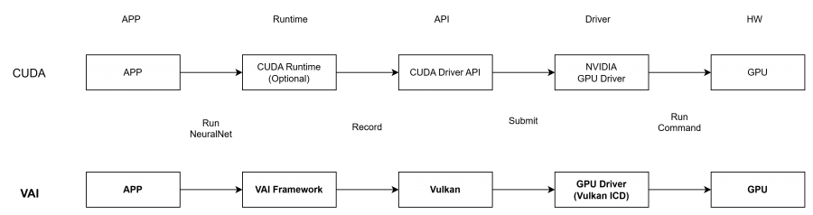
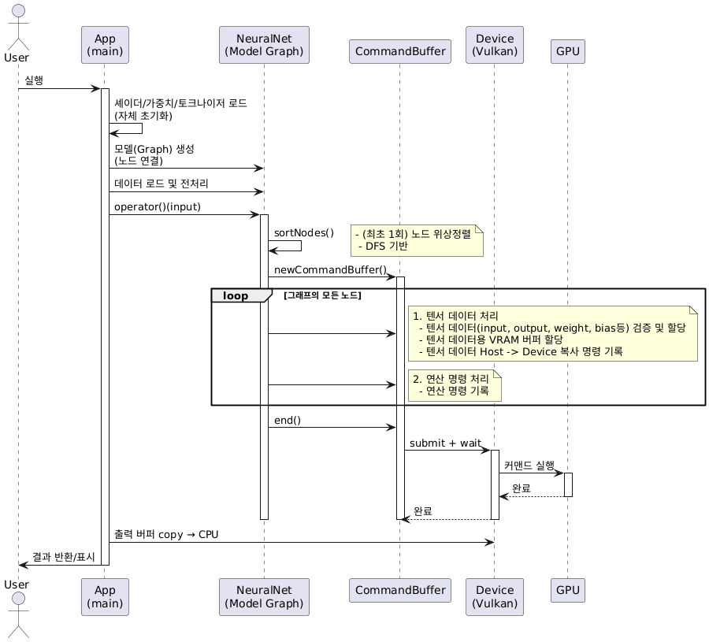
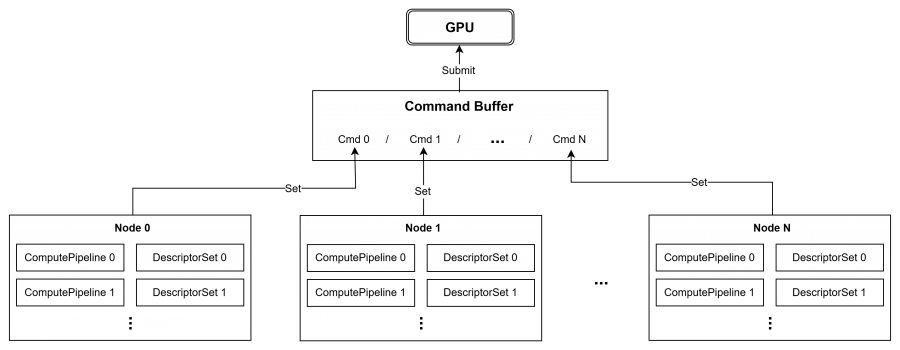
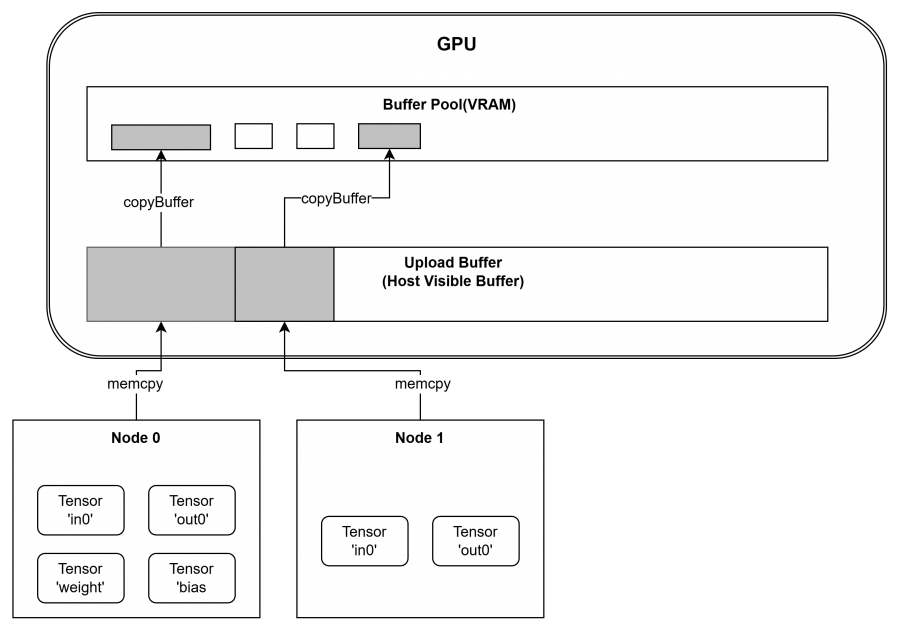

# 개요

VAI (Vulkan AI) - Vulkan 컴퓨트 셰이더를 사용하는 경량 딥러닝 추론 프레임워크

## CUDA와 VAI 계층 비교



| 레이어      | CUDA                                           | VAI (Vulkan)                                                          |
|-------------|------------------------------------------------|-----------------------------------------------------------------------|
| App         | cuda*/cu* 호출로 런타임/드라이버 API 요청    | `operator()(inputs)`로 그래프 실행 요청                                       |
| Framework   | 모듈 로드/메모리/인수 설정 후 Driver API(cuLaunchKernel 등)로 런치 요청 | 노드 그래프를 커맨드 버퍼에 기록<br/> (bindPipeline/DescSets/pushConst/dispatch/barrier) |
| API         | CUDA Driver API → 드라이버로 커맨드 제출       | Vulkan(loader/ICD) → vkQueueSubmit로 드라이버에 제출                          |
| GPU Driver  | NVIDIA GPU Driver                              | GPU Driver (Vulkan ICD)                                               |
| GPU         | 커널 실행                                      | 커맨드 실행                                                                |


## File Tree
```
├─ vulkanApp.h/.cpp        # Vulkan 래퍼: Device, Buffer, Pipeline, CommandBuffer
├─ neuralNet.h             # Node/NodeGroup/NeuralNet 그래프, 실행 및 버퍼 풀
├─ tensor.h                # Tensor 추상화 (host data + GPU buffer 관리)
├─ shaders.h               # 셰이더 소스/파이프라인 캐싱 인터페이스
├─ spirvHelpers.cpp        # GLSL → SPIR-V 컴파일 헬퍼
├─ templateHelper.h        # 템플릿 유틸리티
└─ error.h                 # 단순 오류/어설션 헬퍼
```

## 사전 준비

  * Vulkan SDK와 GPU 드라이버 설치 (헤더/런타임 포함)
  * CMake 3.15+와 C++17 지원 컴파일러
  * 셰이더 컴파일을 위한 glslc(또는 spirv-cross 포함) 확인
  * Windows라면 VK_LAYER_PATH 설정, Linux/macOS는 LD_LIBRARY_PATH 설정 여부 점검

# 전체 흐름 요약


# VAI 실행 구조

VAI는 Vulkan API를 사용하여 Host(CPU)에서 접근가능한 자원들을 Device(GPU)로 전달하는 방식으로 동작한다. 전달해야할 자원에는 연산을 수행할 명령들과 연산에 필요한 텐서 데이터들이 있다. 
이러한 자원들을 **CommandBuffer**라는 일종의 **"수행해야할 Task list"**에 담아서 GPU에 전달한다. 

CUDA와 비교: 일반적으로 사용되는 CUDA Runtime에서는 커널함수를 그때그때 Launch하여 사용하므로 오버헤드 발생한다. VAI는 CUDA graph방식과 비슷하게 모든 명령을 쌓아놓았다가 한번에 제출하여 오버헤드를 최소화한다

## CPU-GPU 연산 관리



VAI에서는 각각의 딥러닝 레이어들은 Node라는 객체를 통해 표현된다. 여기서 GPU연산 명령과 필요 데이터들은 각각 ComputePipeline과 DescriptorSet객체를 통해 관리된다.


### ComputePipeline
  * "이 Shader/설정으로 계산해라"를 나타내는 연산 단위
  * GPU용 연산명령들(ReLU, Conv와 같은 DL용 레이어들 포함)을 표현
  * Shader언어(GLSL)로 작성된 커널 함수 정보를 관리
  
### DescriptorSet  
  * "이 버퍼/데이터를 셰이더에 연결해 써라"라는 매핑 정보
  * 처리해야할 데이터는 Tensor 객체로 선언
  * Tensor 객체의 GPU 버퍼 정보를 Shader 함수의 변수에 매핑

## CPU-GPU 메모리 관리



GPU에서 연산을 수행하기 위해서는 Host(CPU 메모리)에 저장되어 있는 데이터들을 VRAM(GPU 메모리)으로 이동 시켜야한다. 이러한 데이터는 Tensor 객체를 통해 관리되고 있는데, 2가지 변수 hostData(Host용 버퍼)와 _buffer(VRAM용 버퍼)를 사용하여 데이터의 관리를 End to End로 처리한다

TensorData: hostData(CPU)와 _buffer(GPU)를 함께 관리. Tensor는 shared_ptr<TensorData>로 수명 공유

또한 GPU메모리는 BufferPool을 통해 관리된다. 현재 pool에 기존에 사용되었던 비슷한 크기의 비어있는 Buffer가 있다면 이를 할당해주고, 없다면 새로운 GPU 버퍼를 할당해준다

업로드 시퀀스를 정리하자면
  - set() 
  - hostData 채움
  - host-visible 업로드 버퍼(스테이징) 오프셋에 memcpy(연속 적재)
  - copyBuffer를 커맨드에 기록
  - Submit 시 device-local 버퍼로 실제 전송

### UploadBuffer
  * 연속된 GPU 메모리 버퍼
  * Host-visible 버퍼
  * CPU에서 memcpy로 접근하여 host데이터를 이동 가능(업/다운로드)
  * 여러 노드의 Tensor데이터를 offset을 증가시키며 memcpy -> 데이터 "연속" 적재

### BufferPool
  * VRAM 버퍼 관리
  * 실제 GPU연산(Shader 연산)에 사용되는 Buffer들 관리
  * 캐시 히트 시 재할당 없음, miss 시 새로 생성
  * _isConstant=true면 반환을 생략해 가중치 재업로드를 피함

# 주요 클래스

## 1. Node (연산 단위)

하나의 연산(Conv, ReLU, Linear 등)을 캡슐화하며, 파이프라인/디스크립터를 준비하고 슬롯(NodeSlot)으로 Tensor를 주고받습니다.

```cpp
  class MyNode : public Node {
      // 파라미터
      uint32_t input_size, output_size;

    // GPU 리소스
    ComputePipeline pipeline;
    DescriptorSet descSet;

public:
    MyNode(uint32_t in_size, uint32_t out_size)
        : input_size(in_size), output_size(out_size) {}

    void prepare() override {
        // 1. 입력 텐서 가져오기
        Tensor& input = slot("in0");

        // 2. 출력 형태 계산 및 할당
        slot("out0") = Tensor(batch, output_size);
    }

    void run(CommandBuffer cmdBuff) override {
        // 3. 연산 기록
        cmdBuff.bindPipeline(pipeline)
               .bindDescSets({descSet})
               .dispatch(workgroups_x, workgroups_y, workgroups_z);
    }
};
```

주요 변수:
  * slots: 입력/출력 NodeSlot 맵
  * (각 구현체에서) ComputePipeline pipeline: GLSL→SPIR-V 컴퓨트 파이프라인 객체
  * (각 구현체에서) DescriptorSet descSet: 셰이더에서 접근할 버퍼(Tensor의 GPU buffer)를 바인딩

주요 함수:
  * prepare(): 입력 shape 검증, 출력 Tensor 생성/reshape
  * run(CommandBuffer): bindPipeline/bindDescSets/setPushConstants/dispatch/barrier 기록
  * descSet.write()/layout().makeDescriptorSets(): 슬롯에 매칭된 버퍼를 DescriptorSet에 기록
  * slot(name), operator[](name): 슬롯 Tensor 접근

## 2. NodeGroup (블록 단위)

여러 Node를 하나의 블록처럼 묶어 재사용. 내부 슬롯을 defineSlot으로 노출해 체이닝을 단순화합니다.

```cpp
  class ConvBlock : public NodeGroup {
      ConvolutionNode conv;
      ReluNode relu;
    MaxPoolingNode pool;
public:
    ConvBlock(uint32_t inCh, uint32_t outCh, uint32_t k)
        : conv(inCh, outCh, k), pool(2) {
        // 내부 연결
        conv - relu - pool;
        // 외부 입출력 슬롯 노출
        defineSlot("in0", conv.slot("in0"));
          defineSlot("out0", pool.slot("out0"));
      }
  };
```

주요 변수:
  * slots (NodeSlot*): 외부로 노출된 입력/출력 슬롯 참조

주요 함수:
  * defineSlot(name, NodeSlot&): 내부 슬롯을 외부로 노출
  * slot(name): 노출 슬롯 접근

## 3. Tensor

텐서 클래스. host 데이터(CPU)와 GPU 버퍼를 함께 관리함

  * Host 데이터: set(vector<float>)로 CPU 메모리에 값을 저장, 실행 시 업로드 버퍼를 통해 GPU로 복사.
  * GPU 버퍼: buffer()가 반환하는 vk::Buffer에 실제 연산 데이터가 위치. 중간 텐서는 실행 후 버퍼 풀로 반환되어 재사용.
  * 동기화 주의: host 데이터와 GPU 버퍼는 동기화 시점이 다름. 연산 후 CPU에서 값을 보려면 copyBuffer→map() 또는 get() 호출이 필요.

```cpp
// 생성 (형태만 지정)
Tensor tensor = Tensor(28, 28, 1);  // [H, W, C]

// CPU 데이터 → GPU 업로드
std::vector<float> data(28 * 28);
tensor.set(data);

// GPU → CPU 다운로드
std::vector<float> result = tensor.get();

// 형태 변환
Tensor reshaped = tensor.reshape(784, 1);
Tensor permuted = tensor.permute(2, 0, 1);  // [C, H, W]

// GPU 버퍼 접근
Buffer gpu_buffer = tensor.buffer();
```

주요 변수:
  * _shape: 텐서 차원 정보
  * _data: shared_ptr<TensorData> (TensorData가 hostData와 _buffer를 소유)
    * TensorData::hostData: CPU 메모리 데이터(std::vector<float>)
    * TensorData::_buffer: GPU 버퍼 핸들(BufferPool에서 빌려와 보관, 소멸 시 반환)
  * _isConstant: true이면 실행 후에도 버퍼를 반환하지 않고 유지

주요 함수:
  * set(vector<float>): CPU 데이터 설정
  * get(): GPU→CPU 복사 후 데이터 반환
  * reshape(), permute(): 형태 변환
  * buffer(): GPU 버퍼 핸들 접근
  * setConstant(bool): 상수 텐서 표시 → 실행 후에도 buffer를 반환하지 않음 (가중치/정적 파라미터 유지용)

수명/동기화:
  * TensorData를 shared_ptr로 관리하므로 Tensor 복사본이 남아있는 동안 hostData와 _buffer가 유지됨. 마지막 참조 해제 시 BufferPool로 반환.
  * hostData와 _buffer를 모두 TensorData가 소유하므로 CPU↔GPU 전송을 copyBuffer/get/clearHostData로 명시적으로 관리.

## 4. NeuralNet (모델 그래프)

**NeuralNet**은 노드들을 연결하여 전체 모델을 구성합니다.

입력/출력 노드를 포함한 그래프를 구성하고, sortNodes()로 위상 정렬 후 prepare()/run()을 순회하며 커맨드 버퍼에 기록합니다.

```cpp
  class MyModel : public NeuralNet {
      ConvNode conv;
      ReluNode relu;
    LinearNode fc;

public:
    MyModel(Device& device)
        : NeuralNet(device, 1, 1)  // 입력 1개, 출력 1개
        , conv(1, 32, 3)
        , relu()
        , fc(32*26*26, 10)
      {
          // 노드 연결: input -> conv -> relu -> fc -> output
          input(0) - conv - relu - fc - output(0);
      }
  };
```

주요 변수:
  * nodes: 그래프를 구성하는 Node 목록
  * _inputs / _outputs: InputNode/OutputNode 슬롯
  * sortedNodes: sortNodes()로 캐시된 실행 순서
  * bufferPool: 내부 BufferPool 참조(버퍼 재사용)

주요 함수:
  * input(idx) / output(idx): 그래프 입출력 슬롯 접근
  * operator()(Tensor...): 실제 추론 수행. 입력 Tensor 연결 후 실행 호출
  * sortNodes(): DFS 위상 정렬로 실행 순서 결정 및 캐시
  * run(): 노드 prepare()/run() 순회, 커맨드 버퍼 기록/submit
  * clear(): 그래프/버퍼 상태 초기화


# 새로운 모델 만들기

모델 생성 기본 흐름

  - Node 구현: 각 연산을 Node 클래스로 구현 (셰이더 + prepare/run)
  - 모델 조립: NeuralNet에서 노드들을 연결 (operator- 사용)
  - 가중치 로드: JSON 파일에서 가중치를 읽어 텐서에 할당
  - 추론 실행: 입력 텐서를 전달하고 model(input) 호출
  - 결과 확인: 출력 텐서를 CPU로 가져와 처리

## Step 1: Node 구현

기본 제공 노드:
  * ConvolutionNode - 2D 컨볼루션
  * ReluNode - ReLU 활성화
  * MaxPoolingNode - Max Pooling
  * FlattenNode - 텐서 평탄화
  * FullyConnectedNode - Linear/Dense 레이어

새로운 연산이 필요하면 직접 구현:

```cpp
#include "neuralNet.h"

const char* batchnorm_shader = R"(
#version 450
layout(local_size_x = 256) in;

layout(binding = 0) readonly buffer Input { float x[]; };
layout(binding = 1) readonly buffer Mean { float mean[]; };
layout(binding = 2) readonly buffer Var { float var[]; };
layout(binding = 3) readonly buffer Gamma { float gamma[]; };
layout(binding = 4) readonly buffer Beta { float beta[]; };
layout(binding = 5) writeonly buffer Output { float out[]; };

layout(push_constant) uniform Params {
    uint batch;
    uint channels;
    uint spatial;  // H * W
};

void main() {
    uint idx = gl_GlobalInvocationID.x;
    uint total = batch * channels * spatial;

    if (idx < total) {
        uint c = (idx / spatial) % channels;
        float normalized = (x[idx] - mean[c]) / sqrt(var[c] + 1e-5);
        out[idx] = gamma[c] * normalized + beta[c];
    }
}
)";

...
```

```cpp
class BatchNormNode : public Node {
    uint32_t channels;
    ComputePipeline pipeline;
    DescriptorSet descSet;

public:
    BatchNormNode(uint32_t num_channels) : channels(num_channels) {
        pipeline = netGlobalDevice.createComputePipeline({batchnorm_shader});
    }

    void prepare() override {
        Tensor& input = slot("in0");
        slot("out0") = Tensor(input.shape);

        // 파라미터 텐서 할당
        slot("mean") = Tensor(channels);
        slot("var") = Tensor(channels);
        slot("gamma") = Tensor(channels);
        slot("beta") = Tensor(channels);

        // 디스크립터 세트 생성
        descSet = pipeline.layout().makeDescriptorSets(netGlobalDevice, {
            input.buffer().bindDescriptor(0),
            slot("mean").buffer().bindDescriptor(1),
            slot("var").buffer().bindDescriptor(2),
            slot("gamma").buffer().bindDescriptor(3),
            slot("beta").buffer().bindDescriptor(4),
            slot("out0").buffer().bindDescriptor(5)
        })[0];
    }

    void run(CommandBuffer cmdBuff) override {
        Tensor& input = slot("in0");
        uint32_t params[3] = {
            input.shape[0],  // batch
            channels,
            input.shape[1] * input.shape[2]  // H * W
        };

        cmdBuff.bindPipeline(pipeline)
               .bindDescSets({descSet})
               .setPushConstants(0, sizeof(params), params)
               .dispatch((input.size() + 255) / 256, 1, 1);
    }
};
```

## Step 2: 모델 조립

```cpp
  #include "neuralNet.h"
  #include "neuralNodes.h"
  #include "nodes/batchNormNode.h"

class MyModel : public NeuralNet {
    ConvolutionNode conv1;
    BatchNormNode bn1;
    ReluNode relu1;
    ConvolutionNode conv2;
    ReluNode relu2;
    FlattenNode flatten;
    FullyConnectedNode fc;

public:
    MyModel(Device& device)
        : NeuralNet(device, 1, 1)
        , conv1(3, 64, 3)
        , bn1(64)
        , conv2(64, 128, 3)
        , fc(128*24*24, 1000)
    {
        // 모델 그래프 구성
        input(0) - conv1 - bn1 - relu1
                 - conv2 - relu2
                 - flatten - fc - output(0);
    }

    // 가중치 로드용 인터페이스
    void loadWeights(const std::string& file) {
        JsonParser weights(file);
        // ... 가중치 할당
    }
};
```

## Step 3: 사용

```cpp
  #include "myModel.h"

  int main() {
      // 모델 생성
      MyModel model(netGlobalDevice);
    model.loadWeights("model_weights.json");

    // 입력 준비
    std::vector<float> input(3 * 28 * 28);
    // ... 입력 데이터 채우기

    // 추론
    Tensor input_tensor = Tensor(28, 28, 3).set(input);
    Tensor output = model(input_tensor)[0];

    // 결과
    std::vector<float> predictions = output.get();

      return 0;
  }
```

# 디버깅

## 중간 출력 확인

```cpp
  // 중간 레이어 출력 확인
  Tensor intermediate = model.getNode("relu1").slot("out0");
  std::vector<float> data = intermediate.get();

// 통계 출력
float min = *std::min_element(data.begin(), data.end());
float max = *std::max_element(data.begin(), data.end());
  float mean = std::accumulate(data.begin(), data.end(), 0.0f) / data.size();

  std::cout << "Min: " << min << ", Max: " << max << ", Mean: " << mean << std::endl;
```

## 단계별 비교 팁

  * PyTorch 참조 모델과 동일 입력을 넣어 Conv/FC 출력 텐서를 한 층씩 비교해 어디서부터 오차가 시작되는지 확인합니다.
  * 셰이더 인덱싱 오류가 의심되면 작은 입력(1x1, 2x2)으로 출력이 예측 가능한지 실험합니다.
  * Validation 레이어 로그(VK_DEBUG_REPORT/VK_EXT_debug_utils)를 확인해 잘못된 디스크립터 바인딩이나 동기화 누락을 찾습니다.

## Validation 레이어

Vulkan validation 레이어를 활성화하면 GPU 에러를 잡을 수 있습니다:

```bash
# Windows
set VK_LAYER_PATH=C:\VulkanSDK\1.x.x\Bin
set VK_INSTANCE_LAYERS=VK_LAYER_KHRONOS_validation

# Linux/Mac
export VK_INSTANCE_LAYERS=VK_LAYER_KHRONOS_validation
```

# 성능 최적화

## 1. 셰이더 프리로딩

셰이더 컴파일은 첫 실행 시 오버헤드가 큽니다. 미리 로드하세요:

```cpp
  void loadShaders() {
      static std::unordered_map<const char*, ComputePipeline> cache;

      // 모든 셰이더 미리 컴파일
      cache[conv_shader] = netGlobalDevice.createComputePipeline({conv_shader});
    cache[relu_shader] = netGlobalDevice.createComputePipeline({relu_shader});
    // ...
}

// main 시작 시 호출
  int main() {
      loadShaders();
      // ...
  }
  ```

## 2. 버퍼 재사용

추론을 반복할 때 버퍼를 재사용하면 할당 오버헤드를 줄입니다:

```cpp
  // Bad: 매번 새로 할당
  for (int i = 0; i < 100; ++i) {
      Tensor input = Tensor(28, 28, 1).set(data);
      model(input);
  }

// Good: 텐서 재사용
  Tensor input = Tensor(28, 28, 1);
  for (int i = 0; i < 100; ++i) {
      input.set(data);  // 기존 버퍼에 업데이트
      model(input);
  }
  ```

## 3. 워크그룹 크기 튜닝

GPU마다 최적 워크그룹 크기가 다릅니다. 실험적으로 찾아야 합니다:

```cpp
  // 1D 연산
  dispatch((total_size + workgroup_size - 1) / workgroup_size, 1, 1);

  // 일반적인 워크그룹 크기
  // - 1D: 64, 128, 256
  // - 2D: (16, 16), (32, 8), (8, 32)
  ```

## 4. 데이터 이동 최소화

  * 입력/출력을 제외하면 GPU→CPU 복사를 피하고, 중간 결과는 GPU 버퍼로만 전달합니다.
  * 여러 샘플을 연속 추론할 때 host-visible 업로드 버퍼를 재사용해 매번 버퍼를 새로 만들지 않도록 합니다.
  * 필요한 경우에만 copyBuffer로 결과를 내려받고, 디버깅 중이 아니라면 불필요한 get() 호출을 제거합니다.

# 자주 묻는 질문

## Q: 텐서 형태가 맞지 않는다는 에러가 납니다

A: prepare()에서 형태를 확인하세요:

```cpp
  void prepare() override {
      Tensor& input = slot("in0");
      _ASSERT(input.shape.size() == 3);  // [H, W, C] 확인
      _ASSERT(input.shape[2] == expected_channels);
  }
  ```

## Q: GPU 메모리 부족 에러가 납니다

A: 큰 모델은 배치 크기를 줄이거나, 중간 텐서를 명시적으로 해제하세요.


## Q: 첫 실행이 느립니다

A: 셰이더 컴파일 때문입니다. loadShaders()로 미리 로드하세요.
